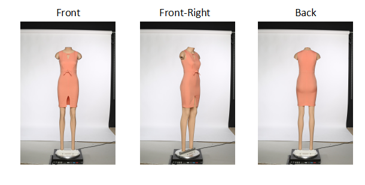
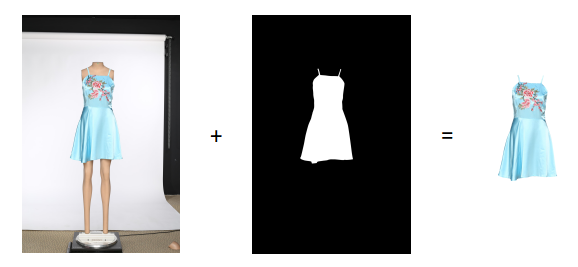
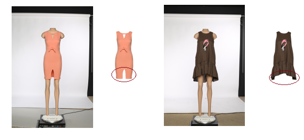

# Machine Learning Engineer Nanodegree
## Capstone Project: Garment Segmentation
John Larsen  
April 7th, 2018

## I. Definition

### Project Overview

The motivation for this project is rooted in my current work at Metail.com where we provide smart technology for fashion imagery. Meaning, shoot images without the need to hire models, photographers, or hair and make up.

#### How it works:
A garment collection is styled and shot on mannequins, then our technology dresses the model (pre-shoot), of the customers choice, in the clothing as if he/she was photographed wearing it.

Actually our models and garments will be shoot at different viewpoints using our own custom rotating photo studio that automatically captures and processes 3 standard images of each garment (and model). Namely Front, Front-Right and Back. 
Image viewpoints: 

The steps involved in creating the catalogue images are:
* Photograph the garment on a mannequin in each of the 3 viewpoints
* Cutout garment for each image and save separately
* Warp cutout garment into position for each viewpoint and each pose on a selected model
* Apply shade (garment/body and vice versa) for each viewpoint and each pose on a selected model
* Change background

Note: above assumes the model is already in the system, if that is not the case then the model will be invited into the photo studio and placed on the turntable. Once on the turntable the model will be photographed in the 3 viewpoints for each pose selected.

Simple. Fast. Efficient.

Well, is is actually not fast and efficient. A larger team based in India is cutting out the garment using Photoshop, then warping the cutout garment to a selected pose and finally shades are applied. Around 14% of the time in generating the final catalogue imagery is based around garment cutouts. We are determined to bring down the time it takes in order to reduce costs and lower turn around time.

What I would like to investigate is how deep learning may help us achieve those goals. In other words using CNN's to generate good quality image masks that our Indian team can use in order to speed-up the cutout stage.

The dataset being used is generated from our past experience of digitizing roughly +10K garments. This is our own data generated from shooting in our own photo studios over the years. The dataset itself consists of two types of images:
* The image shoot on the dressed mannequin
* The Photoshop generated cutout

### Problem Statement

To generate a garment cutout mask that can overlay the original mannequin dressed image thereby allowing an easy way to cutout the garment, see illustration below.

How it works: 

In order to measure the performance and success of the neural work I will use the Dice coefficient (also know as F1 score) as it is a well known metrics to  use for measuring the performance of segmentation work. It literally measures the (Area of Overlap / Area of Union) between two datasets. The two datasets in question here being the alpha cutout mask and the NN predicted garment mask.

#### The Approach
As a solution to our problem we will develop a deep neural network capable of predicting if a given pixel is background or garment. In a nutshell it is a binary classification problem per pixel.

Tasks:
* The data (images) are well understood and coming from our own controlled environment. So all that needs doing is to generate the required tensors for training and validating the imagery with a little preprocessing.
 
* Next we will build a simple model in Keras to run the training data against. Based on the lessons learned from the model we will we will move onto a U-net implementation. Initially keeping it small, 128x128 model, before moving to higher resolution like 1024x1024 model.

* With the U-net model in place the next phase is to evaluate on how:
  * Learning rate affects results, while having a look at cyclical learning rates
  * Optimization algorithms (Adam, RMSProp..) affects results

* The dataset used is reasonably limited in size and that leads us naturally into image augmentation in form of translational invariance, zoom, coloration and intensity. Resulting in a larger dataset, more training data, but also allowing the model to generalize better (reducing over-fitting).

* Lastly, looking at the raw imagery from the studios it is clear that there are some noise in the images from turntable, wires, background sheets and walls etc. What if we initially train a model to predict the garment in the original image, that is, calculate the garment mask and then use this garment mask, by dilating it, to cutout a new image with very little noisy background in it. This second stage image then feeds into a second model (same architectural model) but that has been trained on these 'dilated mask' images, illustrated below. Is that going to give us anything extra?

### Metrics

The Dice coefficient (F1 score) is the main metrics for measuring the performance of the segmentation work, definition below. Reason for selecting this coefficient is that it is a well known and industry accepted metric for measuring the performance of segmentation work. As such it also provides us with a metric to compare against our benchmarks at the end of this section. 

Dice coefficient = 2 * |X ∩ Y| / (|X|+|Y|) = 2TP / (2TP + FP + FN)

where |X| and |Y| are the numbers of elements in the two samples. The Dice coefficient is the quotient of similarity and ranges between 0 and 1. 1 being perfect overlap and 0 no overlap at all. It can be viewed as a similarity measure over sets (Area of Overlap / Area of Union). The two sets here being the alpha cutout mask and the NN predicted garment mask. 

Note: I will compile the Keras model to use the following metrics: 'dice coefficient' & 'accuracy' and likewise the loss function will also have the Dice coefficient built into it together with categorical cross-entropy.

Loss function = weightBCE * binaryCrossEntropy(y_true, y_pred) - weightDice * diceCoeff(y_true, y_pred)

#### Benchmark Models
I have two different benchmarks that I will compare the solution against:
* The first one is a trial done by our R&D team where they used similar imagery and a DeepLab-LargeFOV upsample model, exploiting atrous (dilated) convolutions to increase the field-of-view. Resulting in a Dice score of 98.32% on 2644 images. 

* The second one is the earlier mentioned 'Carvana Image Masking Challenge'. Not exactly the same domain but conceptually a very similar problem. I would argue however that garments are more challenging than cars due to various fabrics, translucent materials, lace, fur etc. Nevertheless I hope to match scores as seen in the Carvana challenge where the winner demonstrated a Dice score around 99.7%

My hope and aim is to obtain a Dice score > 98.32% and close to 99.7%.

## II. Analysis
_(approx. 2-4 pages)_

### Data Exploration & Visualization

The data being used is a smaller subset from our own photo studios over the years. The dataset itself consists of two types of images:
* The image shoot on the dressed mannequin
* The Photoshop generated cutout

The segmentation dataset used here consists of 1084 raw garment images and an equivalent number of cutouts (masks). The resolution of the imagery is 1152x1728, the type is Portable Network Graphics (PNG) thereby using format: RGBA (byte-order). The combined size of the imagery is 1.1 GB.

The cutouts are created by our Indian team using Photoshop on the images shoot on the dressed mannequin. These cutouts are our ground truth and illustrated here:

Image cutouts: 

However we will only use the cutouts indirectly as we won't train and validate against the cutout itself but rather against the alpha-mask contained in the cutout image:

Alpha cutout masks: 

Summary of image data:
<table id="t01">
  <tr>
    <th>All images</th>
    <th>Garments</th> 
    <th>Cutouts</th>
    <th>Front</th>
    <th>FrontRight</th>
    <th>Back</th>
  </tr>
  <tr>
    <td>2168</td>
    <td>1084</td> 
    <td>1084</td>
    <td>724</td>
    <td>720</td>
    <td>724</td>
  </tr>
</table>
    

#### Challenges with current imagery

Our segmentation data available originates from a different product called the ME model experience. Unfortunately one of the problems with this data is, it currently can't handle showing the inside back-layer of a garment if visible. As a result cutouts don't show the inside back-layer at all as illustrated here:

Inaccurate cutout: 

Yes, earlier images of the first dress has been manually modified to contain the back-layer for the cutout and the mask. In reality the inside back-layers are not present in cutouts or masks. This will be a challenge for not least dip hem dresses (longer at the back than the front). The impact will be a slight reduction of the accuracy we can expect for the dataset.

### Algorithms and Techniques

The data (images) are well understood and coming from our own controlled environment. So all that needs doing is to generate the required tensors for training and validating the imagery.
 
Next we will build a simple model in Keras to run the training data against. We will use a Unet neural network (CNN) architecture which will learn how to automatically create the masks:

* By feeding into the neural net the images of the garments
* By using a loss function comparing the output of the neural net with the appropriate masks and back-propagating the error for the network to learn

The output of the network will be a probability map where each entry, read pixel, expresses its probability of being part of the garment. To get to the binary black and white cutout mask we introduces a threshold. Any pixel value equal to or beyond the threshold is deemed garment and the rest is background. It is worth having another look at the Dice Coefficient again:

Dice coefficient = 2 * |X ∩ Y| / (|X|+|Y|) = 2TP / (2TP + FP + FN)

Basically the higher the threshold the fewer false positives (FP) but unfortunately at the expense of more false negatives (FN) - so it is a careful balance in the pursuit of maximizing the Dice Coefficient.

As loss function we will use our own custom loss function utilizing the Dice Coefficient weighting the Dice score higher than the binary-crossentropy (BCE):

Loss = 1/2 * BCE(ground-truth, prediction) - 2 * dice-coeff(ground-truth, prediction)

With the U-net model in place the next phase is to optimize the parameters of the model:
* Classification threshold ​(see above)
* Training parameters
  * Training length (number of epochs)
  * Optimization algorithms (what algorithm to use for learning)
  * Learning rate (how fast to learn; this can be dynamic)
  * Regularization (prevents the model being dominated by a few nodes)
* Neural network architecture
  * Number of layers
  * Layer types (convolution, fully-connected, batch or pooling)
  * Connections between layers

The dataset used is reasonably limited in size and that leads us naturally into image augmentation in form of translational invariance, zoom, coloration and intensity. Resulting in a larger dataset, more training data, but also allowing the model to generalize better (reducing over-fitting).

Lastly, looking at the raw imagery from the studios it is clear that there are some noise in the images from turntable, wires, background sheets and walls etc. What if we initially train a model to predict the garment in the original image, that is, calculate the garment mask and then use this garment mask, by dilating it, to cutout a new image with very little noisy background in it. This second stage image then feeds into a second model (same architectural model) but that has been trained on these 'dilated mask' images, illustrated below. Is that going to give us anything extra?

During training, both the training and the validation sets are loaded into the RAM. After that a few images are selected to be loaded into the GPU memory for processing at a time, our batch-size. Due to K80 GPU memory limitations of 12 GB RAM we can only get away with a small batch size when running with higher resolution images like 1024x1024. The training is done using various optimization algorithms, learning rates and slight variations in the neural network architecture. In contrast to this, inference is done using only the CPU.

### Benchmark
Two different benchmarks will be used to compare our solution against:

* First benchmark comes from a trial done by our R&D team where they used similar imagery, same cutout flaws,  and a DeepLab-LargeFOV upsample model, exploiting atrous (dilated) convolutions to increase the field-of-view. Resulting in Dice score of 98.32% on 2644 images. 

* Second benchmark comes from the [Carvana Image Masking Challenge](https://www.kaggle.com/c/carvana-image-masking-challenge). Not exactly the same domain but conceptually a very similar problem. I would argue however that garments are more challenging than cars due to various fabrics, translucent materials, lace, fur etc. Nevertheless I hope to match scores as seen in the Carvana challenge where the winner demonstrated a Dice score around 99.7%

So the aim is a Dice score > 98.32% and close to 99.7%.

## III. Methodology
_(approx. 3-5 pages)_

### Data Preprocessing
The preprocessing done in the separate “preprocessing” notebook consists of the following steps:
1. Turning the cutouts into proper binary segmentation masks by extracting the Alpha channel from the RGBA input
2. Split the original garment image set into training and validation sets and with the equivalent split on the mask dataset 
3. Load original garment images in color mode and masks in gray scale mode. Actually we will also run an experiment to check if one mode is preferred over the other on the original garment images
4. Resize images into smaller sizes as the GPU can't handle our original image size with a performant deep learning model
5. Turning the image array into a format that Keras can work with, that is, turn the [0, 255] array into a floating point array in the range [0, 1]
6. Normalizing image inputs by subtracting the mean from each pixel, and then dividing the result by the standard deviation. The distribution of such data would resemble a Gaussian curve centered at zero, that is, ensure that each input parameter (pixel, in this case) has a similar data distribution. We will analyze the results both with and without centering and normalizing of the image data
7. Finally a few computer vision algorithms are tried for enhancing contrast with the hope of faster convergence and/or accuracy:
    - Contrast stretching
    - Histogram equalization

In the *Data Exploration* section it was discussed how our ground-truth for certain garments are not 100% accurate as cutouts don't show the inside back-layer. Once a decent predictor is available I will use it to remove outliers (two standard deviations) falling into this category as part of the refinement process. This in order to investigate if that increases accuracy. At the end of the day it is a hard problem to solve well and we don't deliberately want to teach the NN the wrong thing. Of course I could remove these 'wrong' cutouts from the dataset manually but with the amount of data that is available this is not a practical approach. 

Note: it is worth pointing out that all our data has the same resolution, namely 1152x1728. In other words all images have the same size and aspect ratio and does not require any further action.

### Implementation
In this section, the process for which metrics, algorithms, and techniques that you implemented for the given data will need to be clearly documented. It should be abundantly clear how the implementation was carried out, and discussion should be made regarding any complications that occurred during this process. Questions to ask yourself when writing this section:
- _Is it made clear how the algorithms and techniques were implemented with the given datasets or input data?_
- _Were there any complications with the original metrics or techniques that required changing prior to acquiring a solution?_
- _Was there any part of the coding process (e.g., writing complicated functions) that should be documented?_

### Refinement
In this section, you will need to discuss the process of improvement you made upon the algorithms and techniques you used in your implementation. For example, adjusting parameters for certain models to acquire improved solutions would fall under the refinement category. Your initial and final solutions should be reported, as well as any significant intermediate results as necessary. Questions to ask yourself when writing this section:
- _Has an initial solution been found and clearly reported?_
- _Is the process of improvement clearly documented, such as what techniques were used?_
- _Are intermediate and final solutions clearly reported as the process is improved?_

## IV. Results
_(approx. 2-3 pages)_

### Model Evaluation and Validation
In this section, the final model and any supporting qualities should be evaluated in detail. It should be clear how the final model was derived and why this model was chosen. In addition, some type of analysis should be used to validate the robustness of this model and its solution, such as manipulating the input data or environment to see how the model’s solution is affected (this is called sensitivity analysis). Questions to ask yourself when writing this section:
- _Is the final model reasonable and aligning with solution expectations? Are the final parameters of the model appropriate?_
- _Has the final model been tested with various inputs to evaluate whether the model generalizes well to unseen data?_
- _Is the model robust enough for the problem? Do small perturbations (changes) in training data or the input space greatly affect the results?_
- _Can results found from the model be trusted?_

### Justification
In this section, your model’s final solution and its results should be compared to the benchmark you established earlier in the project using some type of statistical analysis. You should also justify whether these results and the solution are significant enough to have solved the problem posed in the project. Questions to ask yourself when writing this section:
- _Are the final results found stronger than the benchmark result reported earlier?_
- _Have you thoroughly analyzed and discussed the final solution?_
- _Is the final solution significant enough to have solved the problem?_

## V. Conclusion
_(approx. 1-2 pages)_

### Free-Form Visualization
In this section, you will need to provide some form of visualization that emphasizes an important quality about the project. It is much more free-form, but should reasonably support a significant result or characteristic about the problem that you want to discuss. Questions to ask yourself when writing this section:
- _Have you visualized a relevant or important quality about the problem, dataset, input data, or results?_
- _Is the visualization thoroughly analyzed and discussed?_
- _If a plot is provided, are the axes, title, and datum clearly defined?_

### Reflection
In this section, you will summarize the entire end-to-end problem solution and discuss one or two particular aspects of the project you found interesting or difficult. You are expected to reflect on the project as a whole to show that you have a firm understanding of the entire process employed in your work. Questions to ask yourself when writing this section:
- _Have you thoroughly summarized the entire process you used for this project?_
- _Were there any interesting aspects of the project?_
- _Were there any difficult aspects of the project?_
- _Does the final model and solution fit your expectations for the problem, and should it be used in a general setting to solve these types of problems?_

### Improvement
In this section, you will need to provide discussion as to how one aspect of the implementation you designed could be improved. As an example, consider ways your implementation can be made more general, and what would need to be modified. You do not need to make this improvement, but the potential solutions resulting from these changes are considered and compared/contrasted to your current solution. Questions to ask yourself when writing this section:
- _Are there further improvements that could be made on the algorithms or techniques you used in this project?_
- _Were there algorithms or techniques you researched that you did not know how to implement, but would consider using if you knew how?_
- _If you used your final solution as the new benchmark, do you think an even better solution exists?_

-----------

**Before submitting, ask yourself. . .**

- Does the project report you’ve written follow a well-organized structure similar to that of the project template?
- Is each section (particularly **Analysis** and **Methodology**) written in a clear, concise and specific fashion? Are there any ambiguous terms or phrases that need clarification?
- Would the intended audience of your project be able to understand your analysis, methods, and results?
- Have you properly proof-read your project report to assure there are minimal grammatical and spelling mistakes?
- Are all the resources used for this project correctly cited and referenced?
- Is the code that implements your solution easily readable and properly commented?
- Does the code execute without error and produce results similar to those reported?- - 