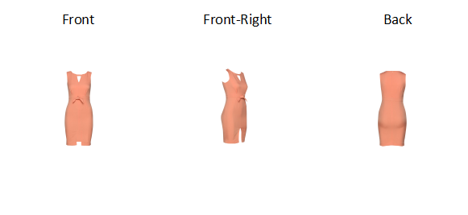
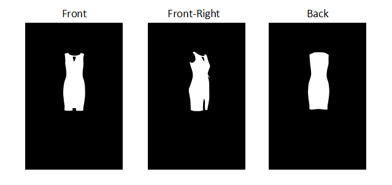
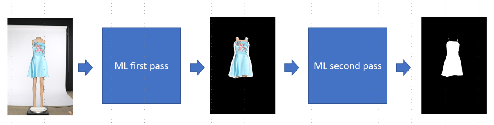

# Machine Learning Engineer Nanodegree
## Capstone Proposal: Garment Segmentation
John Larsen 
April 4th, 2018

## Proposal

### Domain Background

The motivation for this project is rooted in my current work at Metail.com where we provide smart technology for fashion imagery. 

Meaning shoot images without the need to hire models, photographers, or hair and make up.

A garment collection is styled and shot on mannequins, then our technology dresses the model (pre-shoot) of the customers choice in the clothing as if he/she was photographed wearing it.

Simple. Fast. Efficient.

Well, is is actually not fast and efficient. A larger team based in India is cutting out the garment using Photoshop, then warping the cutout garment to a selected pose and finally shades are applied. Around 10% of the time in generating the final catalog imagery is based around garment cutouts. We are very focused on bringing down the time it takes in order to reduce costs and lower turn around time.

What I would like to investigate is how deep learning may help us achieve those goals. In other words using CNN's to generate good quality image masks the our Indian team can use to speed-up the cutout stage.

The following links provides promise for a workable and production worth service: 

* [A 2017 Guide to Semantic Segmentation with Deep Learning](https://blog.qure.ai/notes/semantic-segmentation-deep-learning-review)
* [Background removal with deep learning](https://towardsdatascience.com/background-removal-with-deep-learning-c4f2104b3157)
* [A Brief History of CNNs in Image Segmentation](https://blog.athelas.com/a-brief-history-of-cnns-in-image-segmentation-from-r-cnn-to-mask-r-cnn-34ea83205de4)
* [Semantic Segmentation using Fully Convolutional Networks over the years](https://meetshah1995.github.io/semantic-segmentation/deep-learning/pytorch/visdom/2017/06/01/semantic-segmentation-over-the-years.html)
* [Image Segmentation Keras : Implementation of Segnet, FCN, UNet and other models in Keras](https://github.com/divamgupta/image-segmentation-keras)
* [Awesome Semantic Segmentation](https://github.com/mrgloom/awesome-semantic-segmentation)

### Problem Statement
To generate a garment cutout mask that can overlay the original mannequin image containing the garment thereby allowing an easy way to cutout the garment, see illustration below.

How it works: 

Actually our models and garments will be shoot at different viewpoints using our own custom rotating photo studio that automatically captures and processes 3 standard images of each garment. Namely Front, Front-Right and Back.

In order to measure the performance and success of the neural work I will use the Dice coefficient (also know as F1 score) as it is a well known metrics to  use for measuring the performance of segmentation work. It literally measures the (Area of Overlap / Area of Union) between two datasets.

### Datasets and Inputs

The data-set being used is generated from our past experience of digitizing roughly +10K garments. This is our own data generated from shooting in our own photo studios. For our product, Composed Photography, we capture the imagery in 3 viewpoints as mentioned earlier and illustrated below.

Image viewpoints: 

Now we need a mask to train our NN to learn what a garment looks like. It needs to learn if a pixel is either garment or background. For this purpose we use the manually cut-outs created by our Indian team using Photoshop. The cut-outs are illustrated here:

Image cut-outs: 

We will only use the cutouts indirectly as we won't train and validate against the cutout itself but rather against the Alpha-mask contained in the cutout image:

Alpha cut-out masks: 

Note the segmentation dataset I will use initially consists of 1084 raw garment images and an equivalent number of cut-outs (masks). The resolution of the imagery is 1152x1728. The combined size of the imagery is 1.1 GB.

### Solution Statement

As a solution to our problem we will develop a deep neural network capable of predicting if a given pixel is background or garment. In a nutshell is is a binary classification problem per pixel.

I am heavily influenced and inspired by the Kaggle competition [Carvana Image Masking Challenge](https://www.kaggle.com/c/carvana-image-masking-challenge) that illustrated some great and well performing solutions to this kind of problem. With the [U-net](https://arxiv.org/pdf/1505.04597.pdf) architecture model winning and being used in 5 of the top-10 results this will be my choosen network architecture.

As already mentioned I will use the pixel accuracy but more importantly the Dice coefficient (F1 score) as the metrics for measuring the performance of the segmentation work:

Dice coefficient: 2 * |X ∩ Y|/(|X|+|Y|) = 2TP/(2TP + FP + FN)

where |X| and |Y| are the numbers of elements in the two samples. Dice coefficient is the quotient of similarity and ranges between 0 and 1. It can be viewed as a similarity measure over set (Area of Overlap / Area of Union)

Note: another common metric in segmentation work is the Intersection over Union IoU (also know as Jaccard index). These two indexes are related via:

IoU = Dice/(2 - Dice)

Note: I will compile the model (using Keras) to use the following metrics:['accuracy', 'dice coefficient'] and likewise the loss function will also have the Dice coefficient built into it together with categorical crossentropy.

### Benchmark Model

I have two different benchmarks that I will compare the solution against:

* The first one is a trial done by our R&D team where they used similar imagery and a DeepLab-LargeFOV upsample model, exploiting atrous (dilated) convolutions to increase the field-of-view. Resulting in  scores of MIoU = 98.22% and Dice = 98.32% on 2644 images. 

* The second one is the earlier mentioned 'Carvana Image Masking Challenge'. Not exactly the same domain but conceptually a very similar problem. I would argue however that garments are more challenging than cars due to various fabrics, translucent materials, lace, fur etc. Nevertheless I hope to match scores as seen in the Carvana challenge where the winner demonstrated Dice score ~ 99.7%

So to recap my hope and aim is to obtain a Dice score > 98.32% and close to 99.7%.
 

### Evaluation Metrics

As already mentioned I will use the Dice coefficient (F1 score) as the metrics for measuring the performance of the segmentation work. That is also directly comparable to our two benchmarks:

Dice coefficient: 2 * |X ∩ Y|/(|X|+|Y|) = 2TP/(2TP + FP + FN)

where |X| and |Y| are the numbers of elements in the two samples.

### Project Design

The data (images) are well understood and comming from our own controlled enviroment. So all that needs doing is to put it create the tensors for training and validating the imagery.
 
Next we will build a simple model in Keras to run the trainig data against. Based on the leassons learned from that model we will we will move onto a U-net implementation. Initially keeping it small, 128x128 model, before moving to the 1024x1024 model (the highest the GPU can handle)

With the U-net model in place the next phase is to evaluate on how:
* Learning rate affects results. We will have a look at cyclical learning rates
* Optimization algorithms (Adam, RMSProp..)

The data-set used is reasonably limited in size and that leads us naturally into image augmentation such as translational invariance, zoom, coloration and intensity. Resulting in a larger dataset and thereby more trainig data but also allowing the model to generalise better (reducing overfitting).

Lastly, looking at the raw imagery from the studios it is clear that there are some noise in the images from turntable, wires, background sheets and walls etc. What if we initailly train a model to predict the garment in the original image, that is, calculate the garment mask and then use this garment mask, by dilating it, to cutout a new image with very little noisy background in it. This second stage image then feeds into a second model (same architectural model) but that has been trained on these 'dilated mask' images, illustrated below. Is that going to give us anything extra?

- Would the intended audience of your project be able to understand your proposal?
- Have you properly proofread your proposal to assure there are minimal grammatical and spelling mistakes?
- Are all the resources used for this project correctly cited and referenced?